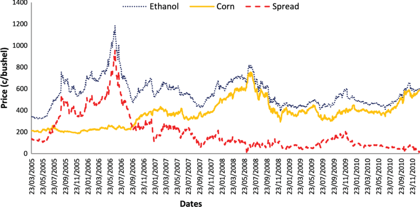

## PairsTradingML

# Introduction
This program implements pairs trading using LSTM networks to inform when to open or close short or long positoins in the market.

The general structure for the code and the math/ general scrture of the algorithm comes from 

	A Machine Learning based Pairs Trading Investment Strategy (SpringerBriefs in Applied Sciences and Technology) 1st ed. 2021

For a more in depth understanding of pairs trading the math behind this algorithm give it a read, but here's a TLDR.

Before we get into how this works it's important to note that, obiviously, this doesn't work. 
There is no magic money making algorithm, even in the test environment that this program runs on it doesn't consitently profit.
Despite this, it is still an intresting apporoach to implementing ML into predictive stock/secutriy trading. 

Pairs trading is an approach to automated securities trading that involves identifying a pair of securites that have a consistent mean reverting spread, 
and then shorting the the security that is increaing in value and going long on the security that is dropping in value. If the spread of the securites reverts back to 
the same historical mean, then there would be a profit on both the short and long positions as the security that dropped in value would go back up, and the security that increaseed in value would go back down. 

The most common example of a "pair" is corn and ethanol securites. The value of corn and ethanol are intrisictly linked since roughly 40% of all ethanol in the US is produced from corn. 
So, Looking at corn and ethanol futures/etfs they tend to have slight variations in price but consitently tend to revert to a similar mean. 

In order to profit off of this trend, if the security increases above or decreaces below the mean you open a short or long position on the security under the assumption that it will revert back to a historical mean, making some profit if it does revert. 
In the graph above its clear that if ethanol was shorted at its peak there would have been a massive profit. The idea behind pairs trading is to find pairs of secirties that can help predict and profit off of these kind of fluxuations. 

# Algorithm Overview

1. Identify pairs
	
	In order to identify a profiable pair the securities must 
		a) be cointegrated
		b) have a hurst exponent less then 0.5